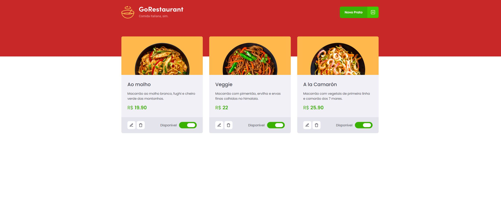

# GoRestaurant Web
Desafio Gostack 11 utilizando React e Typescript consumindo API REST com métodos CRUD.




Intruções:

1- Baixar dependências: 
```javascript
 yarn
```

2- Executar Fake API:
```javascript
   yarn json-server server.json -p 3333
```


3- Executar Front-End:
```javascript
   yarn start
```
